# Machine-Learning
 

### Classification Models

##### Problem Statement 
A Company wants to sell its product.So advertisement is done through sending an email to peoples.After sometime company has gathered some data about the random people (Age,Gender) and  there Action(Y/N) to the email.
Dataset contains Age vs Acion(Yes/No).So I have created a  model which  predicts that whether the new set of people will accept the offer or not. Model is trained on dataset which will find the correlation between independent and dependent varaibles and based on that it will predict the outcome for new test data

So all the below Classification models describes that how many CORRECT and INCORRECT predictions were made on test data which was provided to Model trained on train data

**1. Logistic Regression Classifier**
>11->Incorrect 89->Correct 
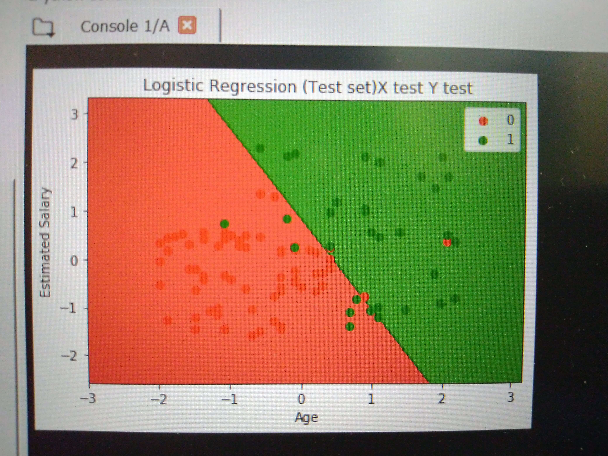 

**2.K-Nearest Neighbors (K-NN)**
>7->Incorrect  93->Correct
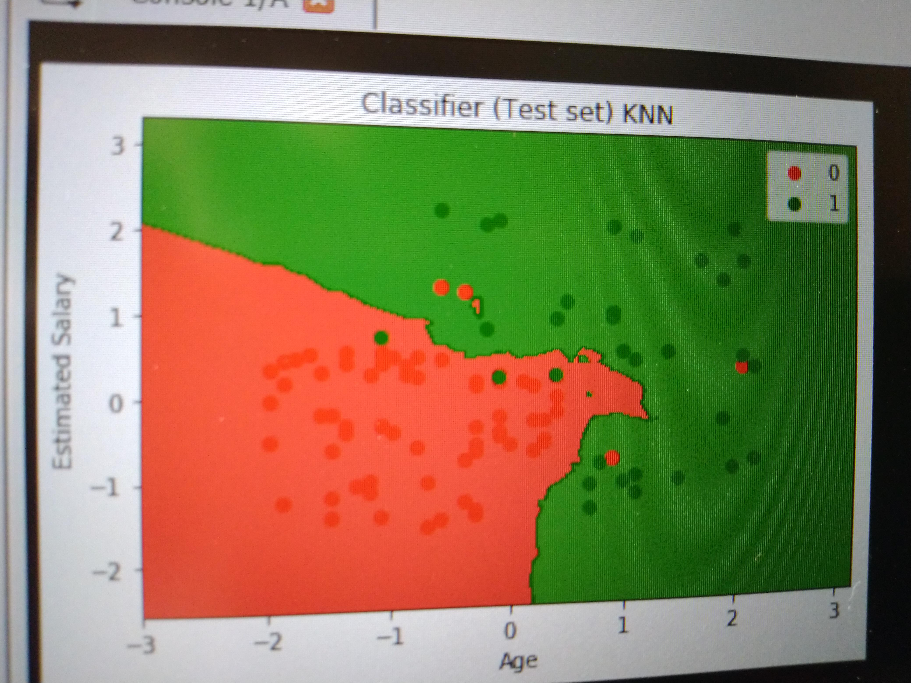

**3.Support Vector Machine (SVM)**
>10->Incorrect 90->Correct
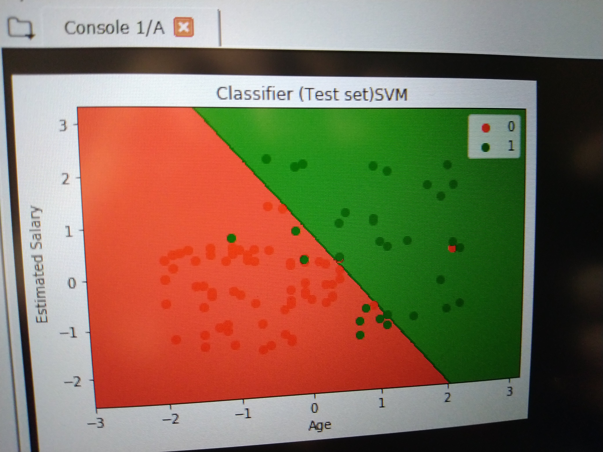

**4.Kernel SVM - Poly**
>14->Incorrect 86->Correct
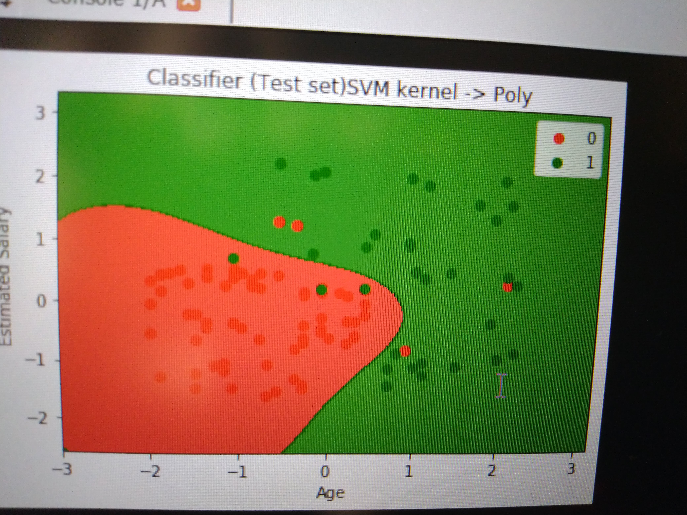

**5.Naive Bayes**
>10->Incorrect  90->Correct
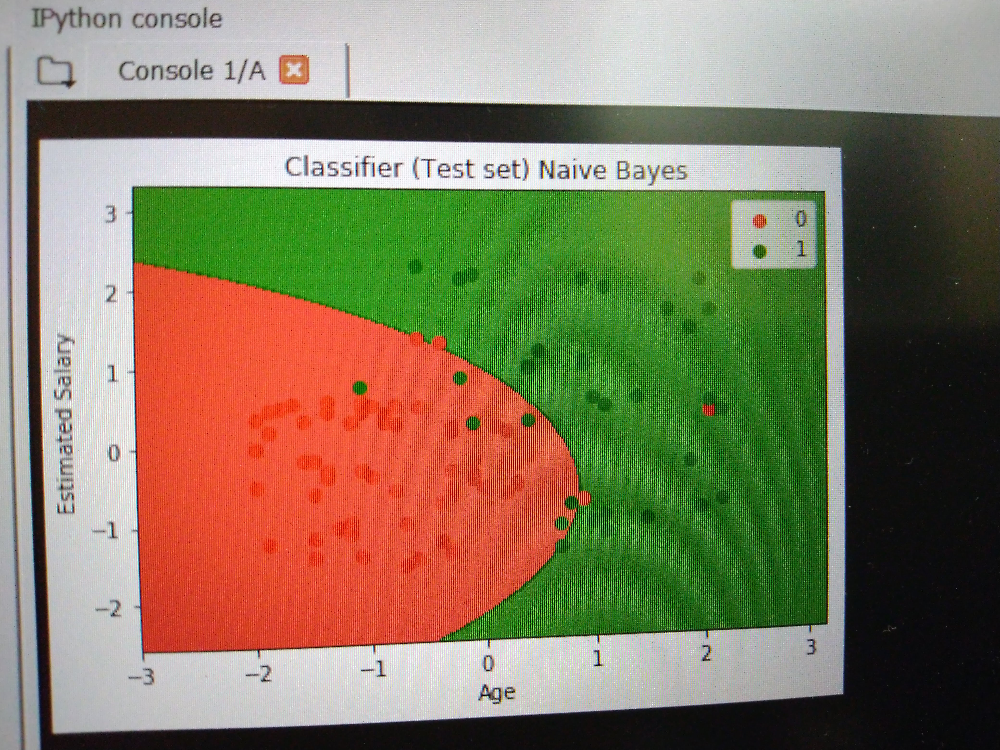

**6.Decision Trees**
>9->Incorrect  91->Correct
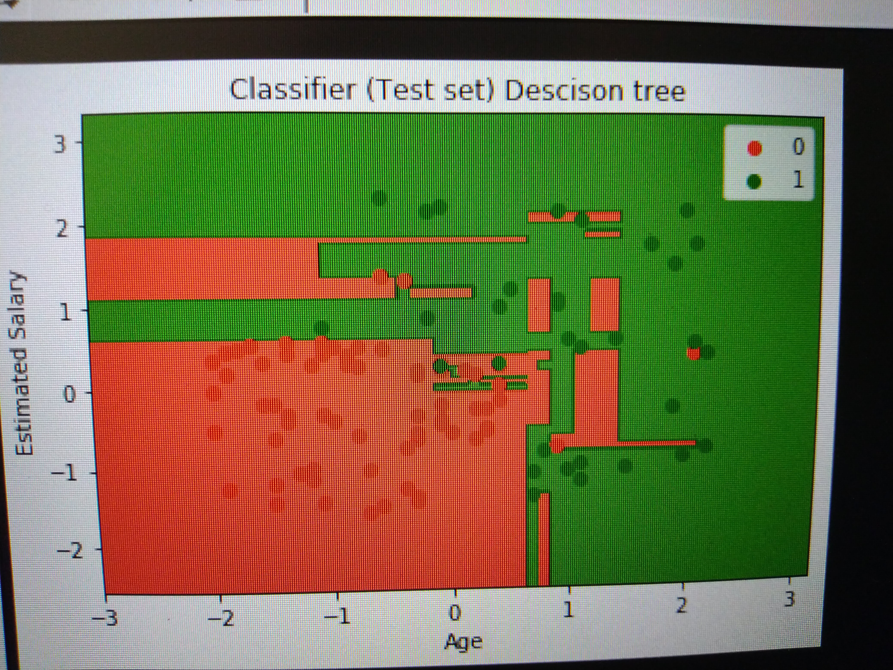

**7.Random Forest**
>8->Incorrect  92->CorrectResults
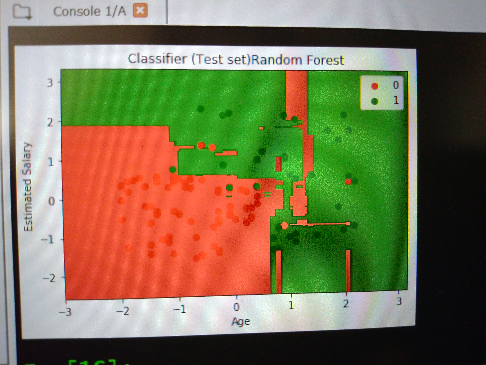

       
### Clustering Models

##### Problem Statement 
An Organization contains an information about its clients that subscribe to their Membership card
Information such as Client_Id,Gender,Age,Annual Income,Spending score.So Based on Annual Income and Spending score.I have created a model which will segment or cluster different type of Clients
So K-Means and Hierarchichal clustering models are used for Clustering different type of Clients

**1. K-Means Clustering**
>Elbow method is used to find optimal no of clusters 
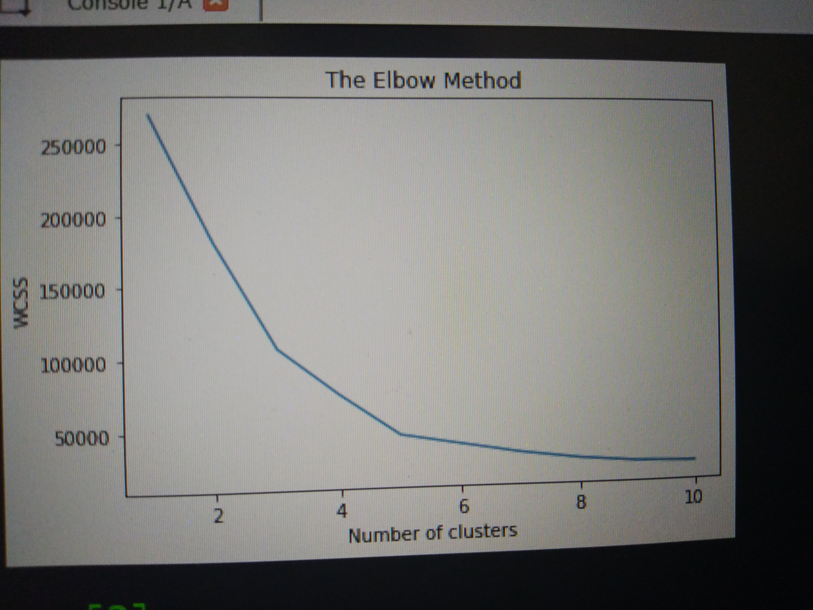 
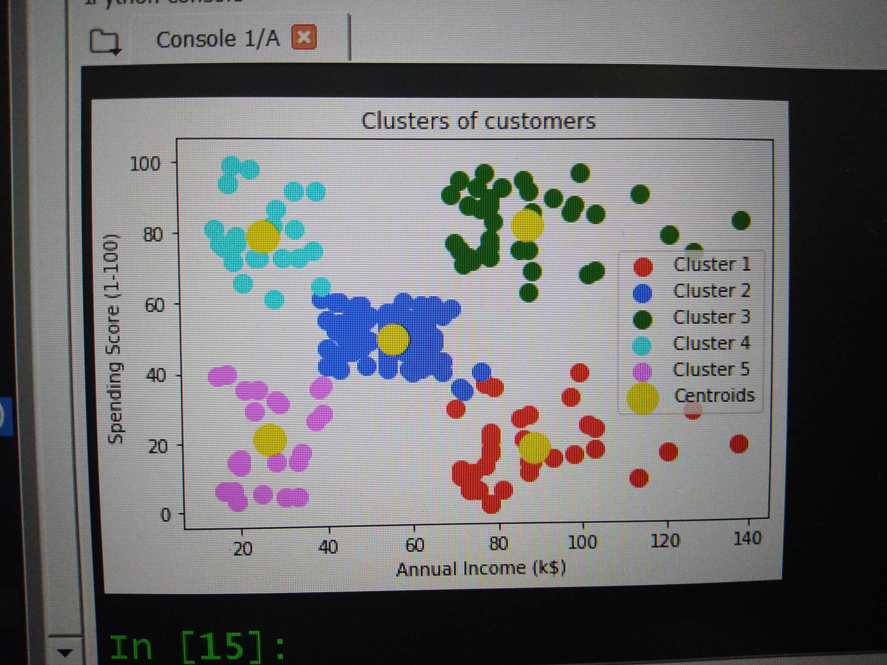 

**2. Hierarchical Clustering**
>Dendrogram is used to find optimal no of clusters 
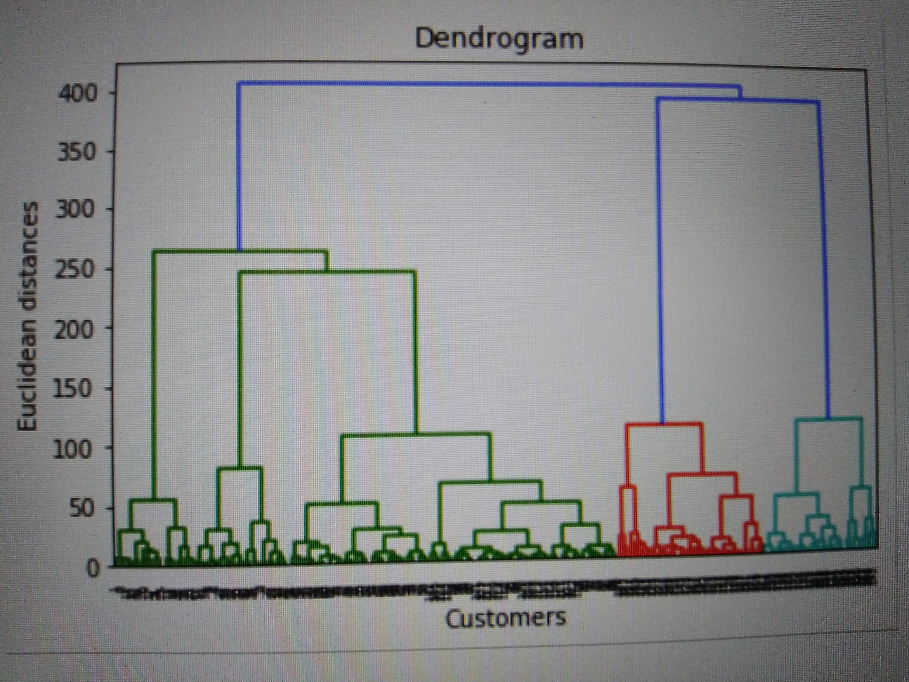 
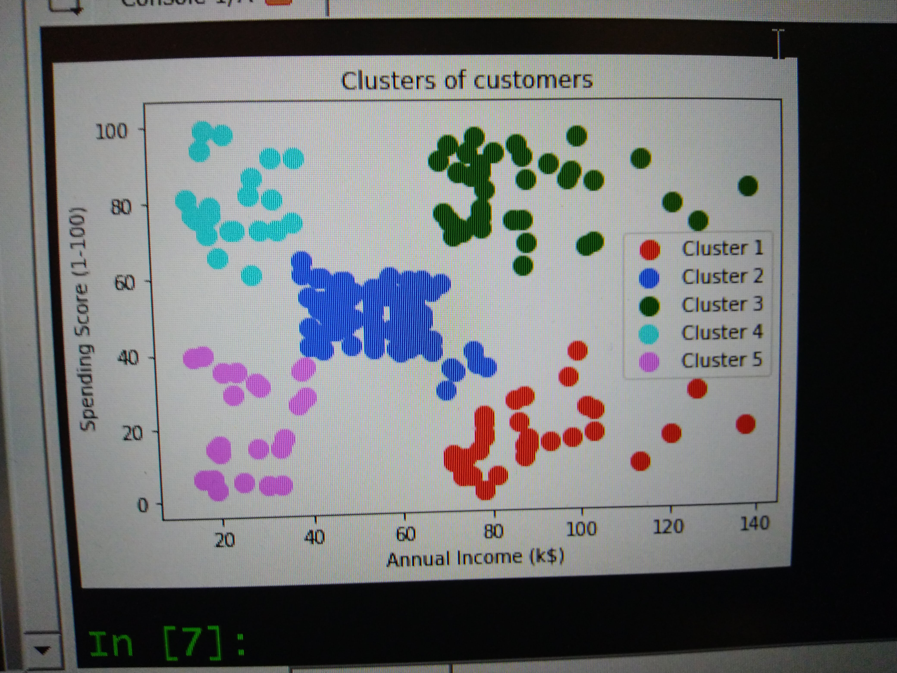 

- Cluster 1 -> Careful Clients
- Cluster 2 -> Standard Clients
- Cluster 3 -> Target Clients
- Cluster 4 -> Careless Clients
- Cluster 5 -> Sensible Clients

#### Reinforcement Learning Models

Car company prepared an 10 Ads that they would put on Social Network.They are not sure about which ads to be put to gain maximum clicks.
Create a best strategy to find out which ads to be displayed   

**1.Upper Confidence Bound**
>
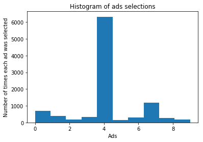

**2.Thompson Sampling**
>
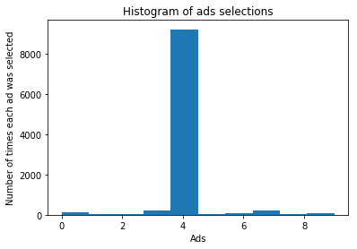
